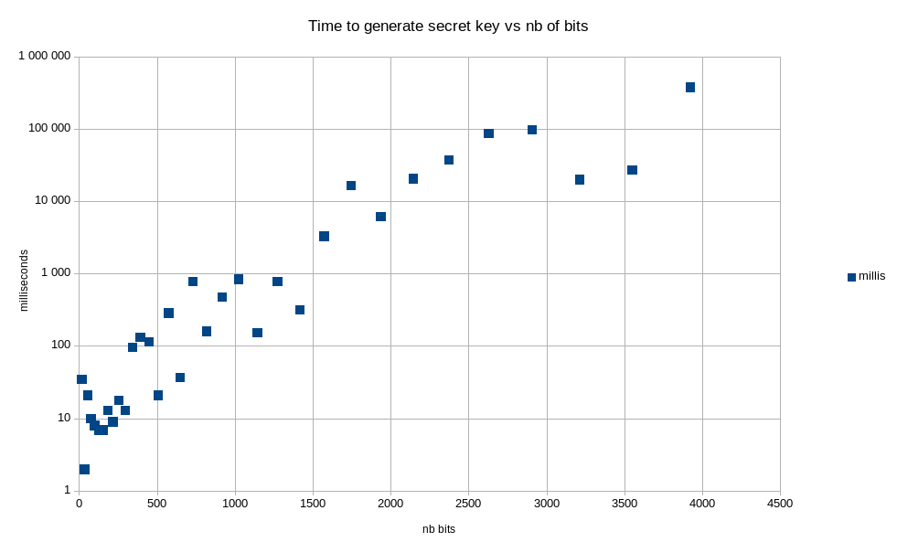

# simpleRsa
A simple, unlimited strength, cryptographic RSA implementation in java, 
using only the java standard librairy.

## How to use/test

* create a private key of selected length,
* derive the public key from the private key,
* you can save either or both to file for sharing. 

*The file format is a text file with, in that order, the public exponent, the modulus, the private exponent (if secretKey). Any following lines are comments.*

then, either :
* encrypt with the public key, 
* and decript with the private key

or :
* sign with the private key, 
* verify with the public key

*digest uses SHA-256*

## Performance is globally exponential with the number of bits

Graph below is showing results ( time to generate secret keys) obtained with no optimization : 
running on netbeans, inside a virtualbox, on top of a windows 10 desktop host ...

**See** the unit tests as an example on how to use.

**note** : File format is different fron the openssh rsa file format
